## Courts

##### [Link](https://github.com/TEAM-HL/courts) to the repo
##### [link](https://bookacourt.info) to the deployed site
--------------
### Purpose
***Courts*** is a simple to use booking application designed for a local tennis court business. It was developed to replace their previous system that relied on phone bookings and cash envelopes.

##### Client Requirements

- Simple & easy to use UI 
- online payments
- Ability for coaches to advertise lessons on a member noticeboard
- Ability for Admin users to: 
  - post events on a member noticeboard
  - create, edit and delete any bookings

### Functionality / Features
There are 3 types of user accounts: *Player*, *Coach* and *Admin*. 

Users must create a profile first before a booking can be made and have the option of uploading a profile picture.

Players can book a court for an allotted time and hire additional tennis gear at checkout. Coaches can do the same as players with the added ability to advertise their coaching services on the member noticeboard.

Admins can create, edit and delete any booking or any post on the virtual noticeboard. 

The homepage for the Player and Coach comprises a tennis court graphic that shows the current and next availability of each court. The Admin has an additional calendar interface to see bookings across days and weeks, as well as events.

### Target audience
The target audience are the players and coaches that use the tennis court and the admin staff who run the court.

### Tech stack (explain what each part of the tech stack is doing)

##### [NodeJS](https://nodejs.org/) 
NodeJS is a JavaScript runtime environment that allows JavaScript code to be run on the server. 

##### [ExpressJS](https://expressjs.com/)

ExpressJS is a web framework that runs on top of NodeJS and will be used to handle HTTP requests, middleware and routing.

##### [MongoDB](https://www.mongodb.com/) / [Atlas](https://www.mongodb.com/cloud/atlas) / [Mongoose](https://mongoosejs.com/)

Our database will be created using *MongoDB*, a NoSQL, non-relational database system. The most important advantage for us is the ability to store any file type in a document model and will allow us to store files that are uploaded to our site by different users. The major use case will be user profile display pictures.

*Mongo Atlas* allows us to store our data in the cloud and connect it to our application.

*Mongoose* is an object modelling solution that is used to interface with and create the schema for the Mongo database.

##### [ReactJS](https://reactjs.org/)

ReactJS will be used to create the interactive UI. The interface components will automatically update to reflect data changes such as bookings made and court availability.

##### [Netlify](https://www.netlify.com/) 

Netlify will host the ReactJS frontend code and assist with testing from the development to the production stage.

##### [Heroku](https://www.heroku.com/)

Heroku will host the backend code and handle traffic, resources, management and device compatibility.

##### [Passport](http://www.passportjs.org/)

For user authentication purposes, we will be using Passport - a NodeJS middleware which plays well with ExpressJS and provides a number of different 'strategies' for authentication using JSON Web Tokens (JWT). We will implement the ~~JWT~~  local strategy method (storing the session-cookie in mongoDB) for the initial MVP and will consider implementing the OAuth 2.0 strategy as an additional feature.

##### [Stripe](https://stripe.com/au)

Stripe will be used to handle payments and refunds for the application. It is easy to use, setup and customise for our application and user experience.

##### [ToastUI Calendar](https://ui.toast.com/tui-calendar) **(yet to be implemented)**

ToastUI is a JavaScript user interface library. We will be specifically using the Calendar features for the admin user to keep track of all events and bookings. Multiple features of the application will require access to the calendar or its data to keep information up to date and in sync. The main benefit of choosing this particular library is that it is open source and versatile enough for our use case. Other options we considered provided the necessary features but required a paid subscription which wasn't an option for us.

##### [Multer ](https://github.com/expressjs/multer)**(yet to be implemented)**

Multer is a middleware that will manage form data and handle the storage of uploaded files in our database.

### Context / Dataflow Diagrams
#### Context Diagram 
The below *context diagram* gives a birds-eye view of the inputs and outputs related to the core purpose of the application. 

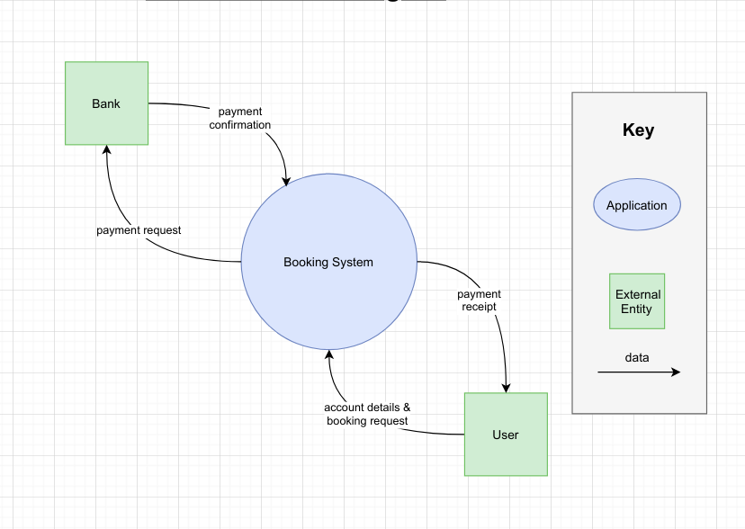

#### Data Flow Diagram - Player & Coach

The below *Dataflow Diagram* illustrates how/what data is passed around the application from the perspective of a Player or Coach.

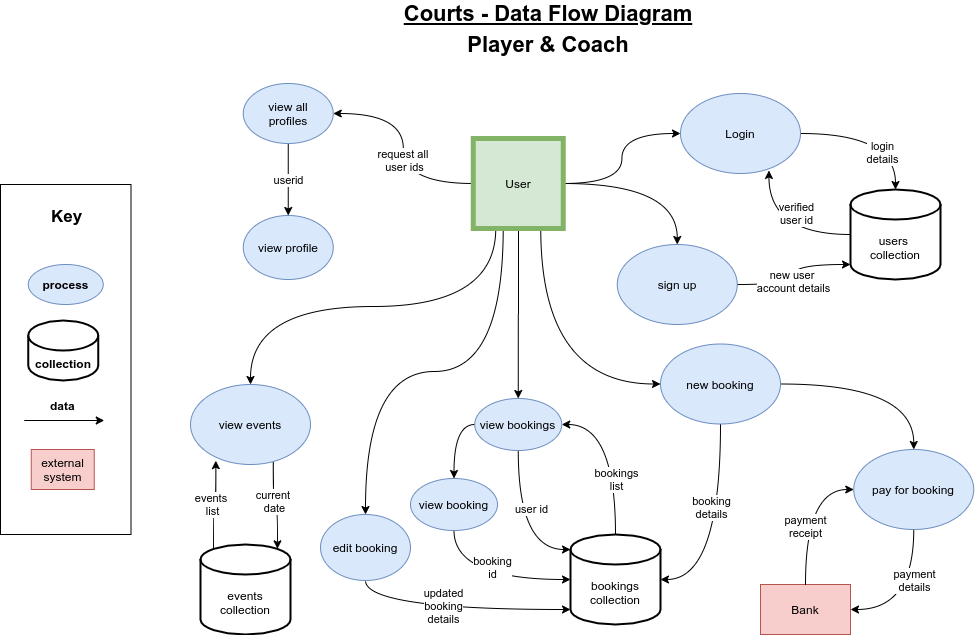

#### Data Flow Diagram - Admin

The below *Dataflow Diagram* illustrates the additional dataflows that exist for an Admin user.

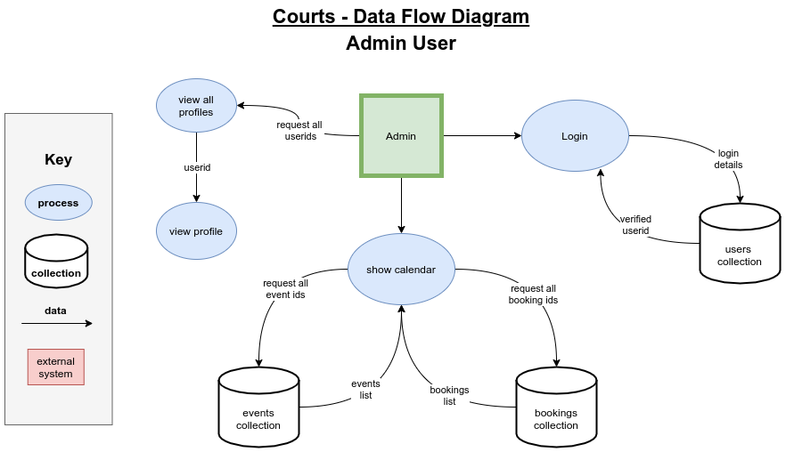

### Application Architecture Diagram

### Personas

We created 3 personas to match the 3 different user types that the app accommodates. 

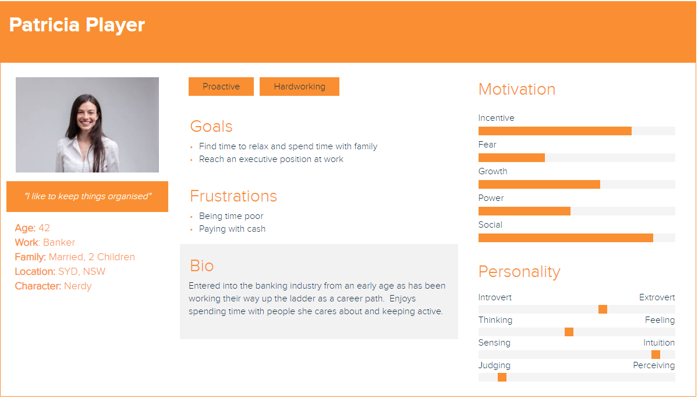
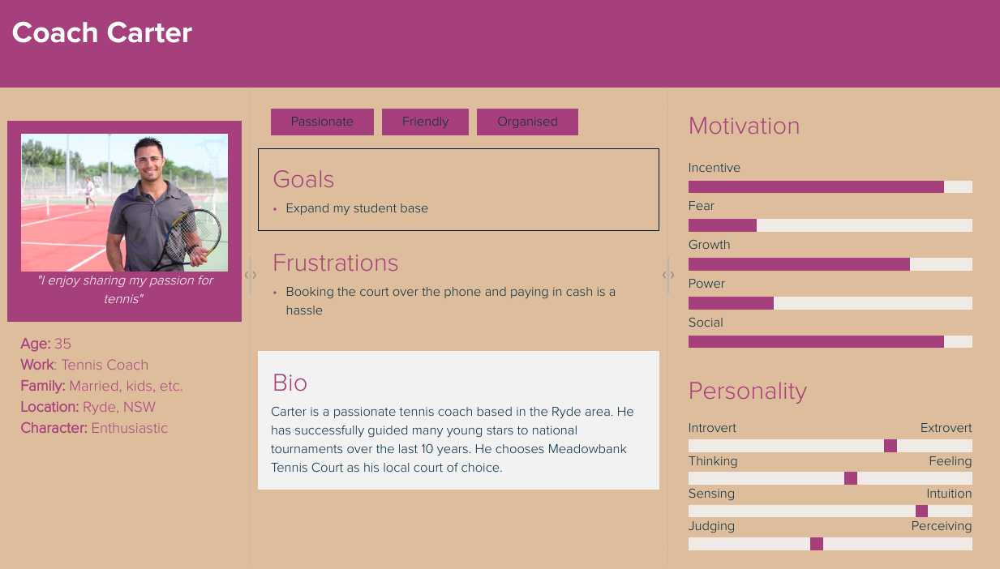
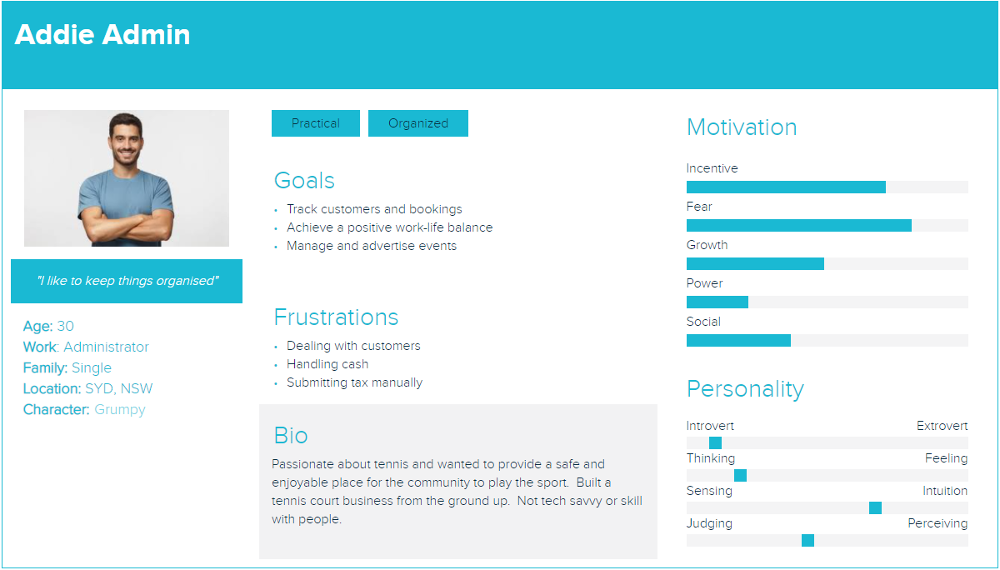

### Original User Stories

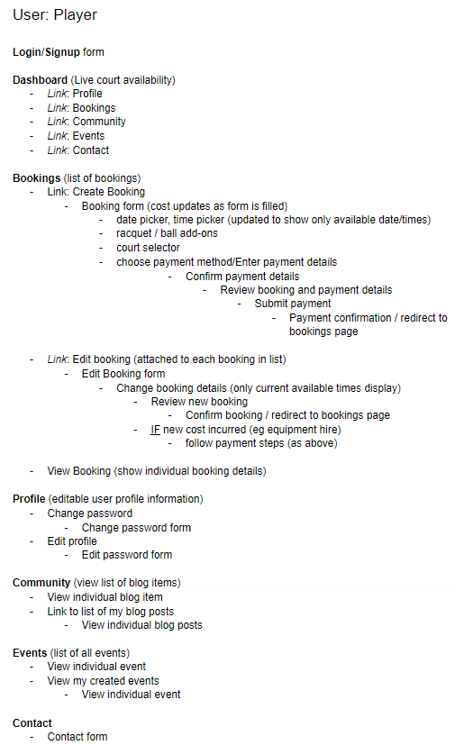
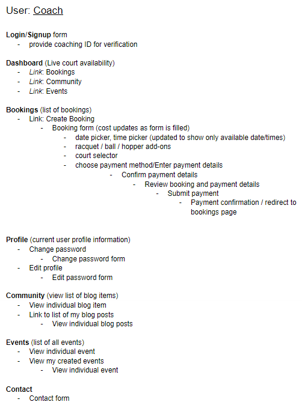
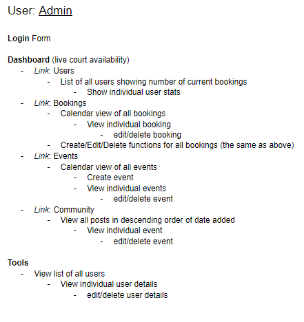

### New User Stories

With the new user stories we wanted to be more succinct with the information we were communicating and show more accurately what our users ere trying to achieve through the use of the application.  The originals only navigated through the actions users could take on the site where as below users have clear goals and we've outlined.  The features of the application have been designed to meet these requirements.

| AS A..     | I WANT TO..                                                  | SO THAT..                                                    |
| ---------- | ------------------------------------------------------------ | ------------------------------------------------------------ |
| **Player** | Create a profile and upload a profile picture                |                                                              |
| **Player** | Create a court booking                                       |                                                              |
| **Player** | Hire additional gear as part of court booking                | only one transaction is required                             |
|            | *include racquet & ball canister options*                    |                                                              |
| **Player** | Send a message to the admin                                  | I can have any query or problem resolved                     |
| **Player** | View my current bookings                                     |                                                              |
| **Player** | View a current booking                                       |                                                              |
| **Player** | Edit or Delete a current booking                             |                                                              |
| **Coach**  | Create a profile and upload a profile picture                |                                                              |
| **Coach**  | Create a court booking                                       |                                                              |
| **Coach**  | Hire additional gear as part of court booking                | only one transaction is required                             |
|            | *include racquet, ball canister & ball hopper options*       |                                                              |
| **Coach**  | Send a message to the admin for assistance                   | I can have any query or problem resolved                     |
| **Coach**  | Post advertisement for lessons on events page                | student players can contact me                               |
| **Admin**  | View all court bookings on a single calendar                 | I can visually assess current court bookings and locate any upcoming bookings |
| **Admin**  | Create, Edit and Delete any event post                       |                                                              |
| **Admin**  | Create, Edit and Delete any court booking                    |                                                              |
| **Admin**  | Create, Edit and Delete any user player or coach user profile |                                                              |
| **Admin**  | View all player and coach user profiles                      | I can easily locate a user                                   |

### Wireframes

The home page for the wireframes is potentially the most key to the application.  This is because a huge focus of the app (client requirement) is to improve the customer experience of interacting with the business.  With this we have tried to design the home screen to deliver the most important information to the customer as effectively as possible (Court availability).

[Link to all Wireframes](https://whimsical.com/mern-v3MZpTtLABX88ZMJNVE96)

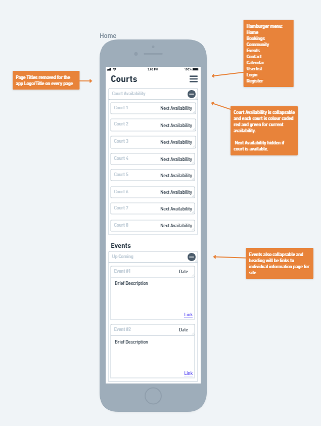

Some additional features to the application include account types.  For example admin accounts will have access to a userlist to quickly find individuals and their profiles.  All user accounts will be player accounts by default so admins neede permission to edit user accounts when coaches have been verified.  Below are some admin account screens.

Userlist            |  Profile | Edit Profile
:--:|:--:|:--:
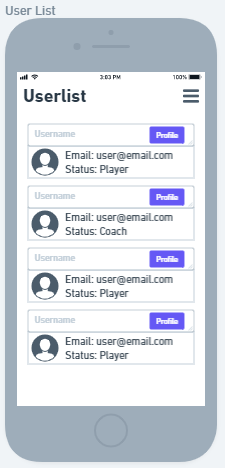  |  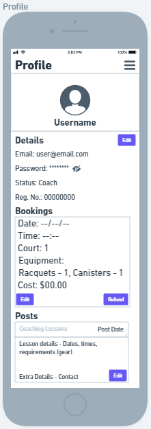 | 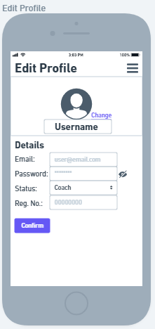

In terms of responsiveness outside some margin and spacing changes there won't bee anything too major changing with design.  The biggest changes will be the home page for Tablet and Desktop, making use of the larger screen size to introduce a graphic for court availability and a navigation bar on desktop to utilise screen width.

Tablet (availability) | Desktop (nav bar)
:--:|:--:
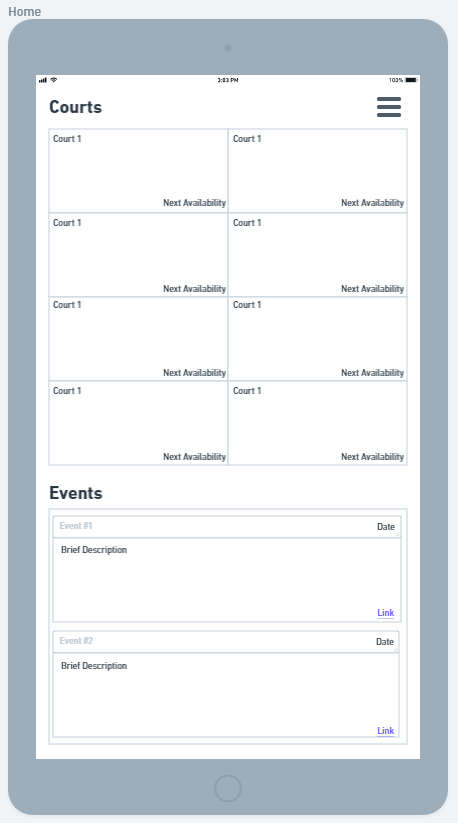 | 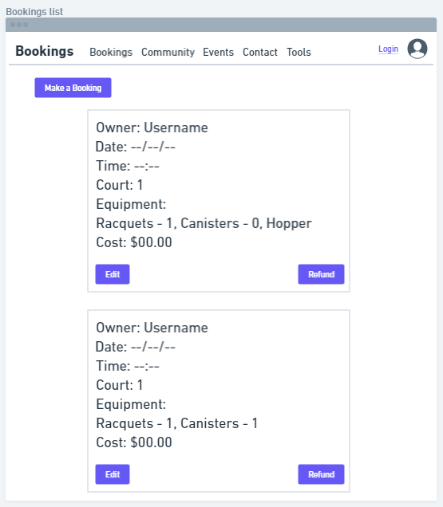

### Trello

We opted for a kanban board template and set 3 coloured labels indicating priority (low, med, critical) and 2 coloured labels indicating whether the card is associated with the backend or the frontend. When a card is in the 'To-Do' or 'Doing' list, it is given a due date and ticked off when completed. When working on a card, the dev assigns themselves to it so that division of work is clear.

[Link to Trello Board](https://trello.com/b/GHuhu7dd/courts) 
[Link to join Trello board](https://trello.com/invite/b/GHuhu7dd/83360285c1d87db8a435d2308b86d1e2/courts)

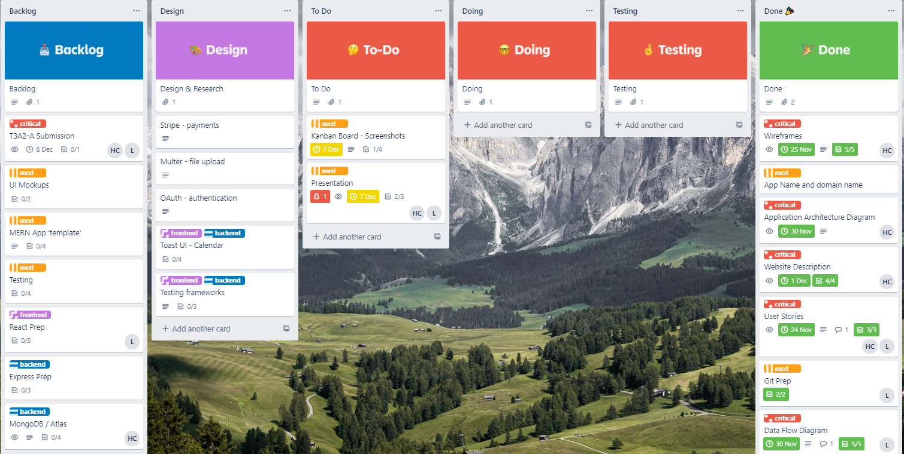

Trello Dataflow card | Trello Wireframe card
:--:|:--:
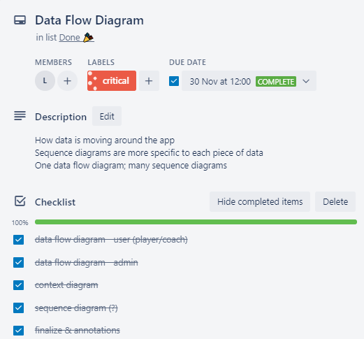  |  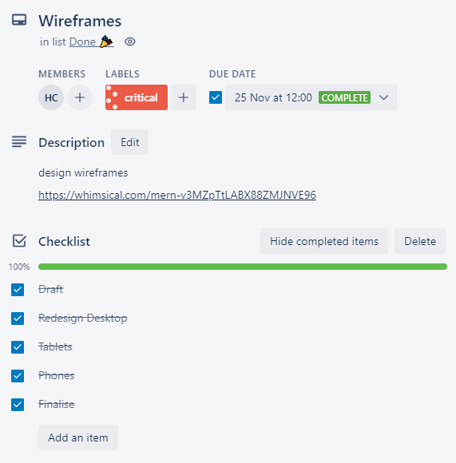

